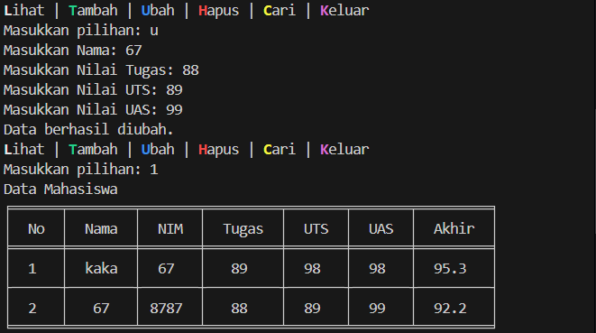
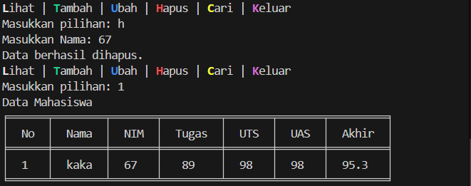

# Program Data Nilai Mahasiswa


# Cara Kerja Program Ini
1. Menampilkan menu kepada pengguna.
2. Meminta pengguna untuk memilih salah satu opsi.
3. Memanggil fungsi yang sesuai dengan pilihan pengguna.
4. Mengulang langkah 2 sampai pengguna memilih opsi keluar.

# Gambaran Flowchart


# Struktur Kode

### Modul
```ruby
from tabulate import tabulate 
# modulnya harus ada
```
Program ini menggunakan modul Tabulate untuk menampilkan tabel data kepada pengguna.

### Meethod dan Fungsi
```ruby
# fungsi ini menggunakan modul tabulate untuk mencetak table data
def tabel(data, headers=None, title=""):
    if not data: 
        table = [["Tidak ada data"]]
        print(tabulate(
            table, 
            headers =["Tidak ada data"], 
            tablefmt="fancy_grid", 
            colalign=("center",)
            ))
        return
    if headers is None:
        headers = ["No", "Nama", "NIM", "Tugas", "UTS", "UAS", "Akhir"]
    table = []
    for i, nama in enumerate(data, start=1):
        row = [
            i, 
            nama, 
            data[nama]["NIM"], 
            data[nama]["Nilai Tugas"], 
            data[nama]["Nilai UTS"], 
            data[nama]["Nilai UAS"], 
            data[nama]["Nilai Akhir"]
            ]
        table.append(row)
    print(f"{title}")
    print(tabulate(
        table, 
        headers, 
        tablefmt="fancy_grid", 
        colalign=("center",)*7
        ))
```
```ruby
class mahasiswa:
    def __init__(self, mahadata={}):
    # inisialisasi class
    # ada dictionary untuk simpan data nilai mahasiswa juga
        self.m = mahadata
```
```ruby
    def nilai(self, str):
    # method untuk memastikan input adalah angka
    # dan mengulangi permintaan jika input bukan angka
    # juga untuk membatasi nilai input yang diinputkan.
        while True:
            try:
                self.poin = float(input(str))
                if self.poin < 0 or self.poin > 100:
                    print(f"Nilai harus berkisar dari 0 hingga 100.")
                else:
                    return self.poin
            except ValueError:
                print("Input harus berupa angka!!")    
```
```ruby               
    def namamu(self, str, harus_ada=True):
    # method ini akan meminta input nama dari user
    # dan melihat apakah nama yang diinputkan tersebut ada di dictionary atau tidak
        while True:
            self.nama = input(str)
            if harus_ada and self.nama not in self.m:
                print("nama tidak ditemukan!")
            elif not harus_ada and self.nama in self.m:
                print("nama sudah ada di database. Masukkan nama lain!")
            else:
                return self.nama  
```
```ruby         
    def minta(self, nama):
    # method ini
    # gunanya untuk mendapatkan input dari user
        tugas, uts, uas = map(self.nilai, [
                "Masukkan Nilai Tugas: ", 
                "Masukkan Nilai UTS: ", 
                "Masukkan Nilai UAS: "
                ])
        akhir = (tugas*0.3) + (uts*0.35) + (uas*0.35)
        if nama not in self.m:
            NIM = input("Masukkan NIM (e.g. 123456789): ")
            return { # akan mengembalikan/menyerahkan data ke method yang memanggil
                "Nama": nama,
                "NIM": NIM,
                "Nilai Tugas": tugas,
                "Nilai UTS": uts,
                "Nilai UAS": uas,
                "Nilai Akhir": akhir
            }
        # sekaligus melihat apakah data dengan nama yang sama ada di dictionary
        elif nama in self.m:
            return { # lihat return diatas
                "Nama": nama,
                "NIM": self.m[nama]["NIM"], # NIM dari data lama
                "Nilai Tugas": tugas,
                "Nilai UTS": uts,
                "Nilai UAS": uas,
                "Nilai Akhir": akhir
            }
```
```ruby  
    def tambah(self):
    # method ini akan menambahkan data yang sudah diterima oleh method minta
    # ke dalam dictionary
        self.nama = self.namamu("Masukkan Nama: ",harus_ada=False)
        self.m[self.nama] = self.minta(self.nama)
        print("Data berhasil ditambahkan.")
```  
```ruby
    def ubah(self):
    # method akan mencari data dengan nama yang sesuai
    # kemudian meminta input data baru
    # input tersebut akan menggantikan data yang sudah ada
        self.nama = self.namamu("Masukkan Nama: ")
        # method namamu dipakai untuk membedakan antara method tambah dan ubah
        # untuk konteks lihat method minta
        self.m[self.nama] = self.minta(self.nama) 
        print("Data berhasil diubah.")
```
```ruby    
    def hapus(self):
    # method ini gunanya untuk hapus data dari dictionary
        self.nama = self.namamu("Masukkan Nama: ")
        # method namamu disini untuk memastikan bahwa nama yang diinput itu ada di dictionary
        del self.m[self.nama]
        print("Data berhasil dihapus.")
```
```ruby  
    def lihat(self):
    # method untuk menampilkan data yang ada di dictionary
        tabel(self.m, title="Data Mahasiswa") 
```
```ruby
    def cari(self):
    # akan mencari dengan nama
    # data dengan nama tersebut akan ditamplikan kepada user
        self.nama = self.namamu("Masukkan Nama: ")
        # method namamu sama seperti yang ada di method hapus
        # untuk memastikan bahwa nama yang diinput itu ada di dictionary
        tabel({self.nama: self.m[self.nama]}, title=f"Data Mahasiswa dengan Nama {self.nama}")
```


### Menu
```ruby
# ini juga dictionary
# tugas nya adalah memamnggil method 
menu = {
    "1": a.lihat,   "l" : a.lihat,
    "2": a.tambah,  "t" : a.tambah,
    "3": a.ubah,    "u" : a.ubah,
    "4": a.hapus,   "h" : a.hapus,
    "5": a.cari,    "c" : a.cari,
    "6": exit,      "k" : exit
}
# ini perulangan 
while True:
    print(
        f"{p}L{r}ihat |", 
        f"{h}T{r}ambah |", 
        f"{b}U{r}bah |", 
        f"{m}H{r}apus |", 
        f"{k}C{r}ari |", 
        f"{u}K{r}eluar"
    )
    opsi = input("Masukkan pilihan: ").lower()
    if opsi in menu:
        menu[opsi]()
    else:
        print("pilih yang ada saja.")
```
Program akan terus menampilkan menu kepada pengguna sampai opsi keluar di pilih. Setiap opsi akan memanggil fungsi yang sesuai.


# Output Dari Program Ini
```Menambahkan Data```


```Menampilkan tabel data```


```Mengubah data```



```Mencari```

 

```Menghapus data```



```Keluar```

